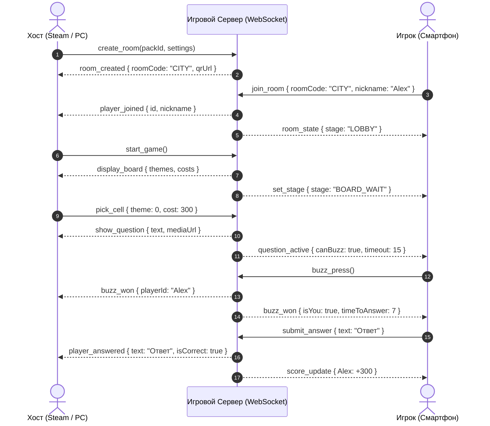

# 🎮 План реализации кроссплатформенной онлайн-викторины (Steam + Mobile + Web)

Документ содержит концептуальный технический план и архитектуру перевода викторины **Quiz U** из оффлайн-браузерного формата в полноценную сетевую кроссплатформенную игру с запуском в **Steam** и на **мобильных платформах (iOS / Android / Mobile Web)** с единым кросс-плеем.

* 📖 **Инструкция для разработчика:** [DEV_GUIDE.md](file:///C:/Users/user/IdeaProjects/quiz_u/DEV_GUIDE.md)
* 🗺️ **Поэтапный трекер разработки:** [ROADMAP.md](file:///C:/Users/user/IdeaProjects/quiz_u/ROADMAP.md)
* 🎨 **Steam Direct, ассеты и SMM:** [DESIGN_GUIDE.md](file:///C:/Users/user/IdeaProjects/quiz_u/DESIGN_GUIDE.md)

---

## 1. Концепция и архитектурная модель

Для обеспечения максимального удобства и минимального барьера входа для игроков выбрана **гибридная модель «Jackbox-Style + Cross-Play»**:

1. **Host-экран (ПК / Steam / Большой экран):**
   * Работает как приложение в Steam (Windows / Linux / Steam Deck).
   * Выводит общее игровое поле, табло вопросов, таймеры, видео-, аудио- и графические материалы раундов, анимации кота в мешке и аукциона.
   * Может управляться мышью/клавиатурой и геймпадом (Steam Controller / DualSense / Xbox Controller).

2. **Клиент игрока (Смартфоны / Планшеты):**
   * **Основной сценарий (Web/PWA):** Игрок сканирует QR-код с экрана Хоста или переходит по ссылке и вводит 4-значный код комнаты (например, `GAME`). Не требует обязательной установки приложения из магазинов.
   * **Дополнительный сценарий (Mobile Store):** Отдельные нативные приложения в Google Play и App Store (через Capacitor) для тех, кто хочет играть вне одной комнаты или сохранять личный профиль.
   * **Функционал экрана игрока:** кнопка нажатия на ответ (Buzzer) с тактильным откликом, клавиатурный ввод ответа, выбор команды для передачи «Кота в мешке», слайдер ставки в «Аукционе», личный счет и статус.

---

## 2. Стек технологий

```text
┌────────────────────────────────────────────────────────────────────────┐
│                          КЛИЕНТСКИЕ ПРИЛОЖЕНИЯ                         │
├──────────────────────────────────┬─────────────────────────────────────┤
│      ПК / Steam (Host-клиент)    │     Мобильные устройства (Игроки)   │
│  Tauri (Rust + Web) / Electron   │    Mobile Web (PWA) / Capacitor     │
│  HTML5 + Canvas / CSS3 / Vanilla │    Легкий адаптивный UI (Buzzer)    │
│  Steamworks SDK (steamworks.js)  │    Виброотклик (Vibration API)      │
└─────────────────┬────────────────┴──────────────────┬──────────────────┘
                  │                                   │
                  │ WebSocket (JSON / WSS)            │ WebSocket (WSS)
                  ▼                                   ▼
┌────────────────────────────────────────────────────────────────────────┐
│                        СЕРВЕРНАЯ ИНФРАСТРУКТУРА                        │
├────────────────────────────────────────────────────────────────────────┤
│  Node.js (TypeScript/JS) + Colyseus / ws (Авторитарный сервер комнат)  │
│  Redis (In-Memory Room State, быстрые тайминги и синхронизация)        │
│  PostgreSQL (Аккаунты, глобальные паки вопросов, статистика матчей)    │
│  S3 / Cloudflare R2 + CDN (Раздача тяжелого медиа: MP3, MP4, WebP)    │
└────────────────────────────────────────────────────────────────────────┘
```

### 2.1. Клиентская часть
* **Основной UI:** Переиспользование текущих наработок (`index.html`, `style.css`, SVG-анимации) с изоляцией логики движка в `js/core/`.
* **Сборка под Steam:**
  * **Tauri (рекомендуется):** ультралегкий билд (15–30 МБ вместо 150+ МБ у Electron), минимальное потребление RAM, компиляция под Windows (.exe/msi) и Linux/SteamOS (.AppImage).
  * **Интеграция Steam:** Библиотека `steamworks-rs` (для Tauri) или `steamworks.js` (для Node/Electron).
* **Мобильная среда:**
  * **CapacitorJS:** позволяет обернуть тот же веб-код в нативный Android (Android Studio) и iOS (Xcode) проект без необходимости писать два разных приложения.

### 2.2. Серверная часть
* **Язык и рантайм:** Node.js / Bun (TypeScript/JS).
* **Игровой сервер комнат:** **Colyseus** (фреймворк для мультиплеерных комнат на WebSockets) или легковесный `ws`.
* **State Management:**
  * **Server-Authoritative:** сервер хранит истинное состояние матча, управляет раундами и таймерами. Клиенты отправляют действия (`BUZZ`, `SUBMIT_ANSWER`, `MAKE_BET`) и рендерят пришедший стейт.
  * **Античит:** правильные ответы **не отправляются** на клиенты игроков до момента раскрытия ответа ведущим.

---

## 3. Сетевой протокол и сценарий игры



### Механизм переподключения (Reconnection Token)
При входе в комнату игроку в `localStorage` записывается `sessionToken`. При обрыве связи (Wi-Fi -> LTE) или перезагрузке мобильного браузера клиент отправляет `RECONNECT { sessionToken, roomCode }`. Сервер восстанавливает игрока на текущий раунд с сохранением очков и состояния.

---

## 4. Специфика интеграции со Steam

1. **Steamworks SDK:**
   * **Steam Auth Ticket:** Автоматическая авторизация пользователя Steam без форм ввода паролей.
   * **Steam Rich Presence:** Отображение статуса в списке друзей Steam: *"В викторине (Раунд 2, 4/8 игроков)"*.
   * **Steam Lobbies:** Возможность приглашать друзей из Steam в один клик.
   * **Steam Cloud:** Хранение пользовательских настроек и кастомных паков.
   * **Steam Workshop (Мастерская):** Возможность сообществу выкладывать и скачивать паки вопросов прямо из игрового каталога.

2. **Совместимость со Steam Deck (SteamOS Verified):**
   * Разрешение 1280x800.
   * Навигация с геймпада (D-Pad / стики для выбора вопросов, кнопки A/B/X/Y).
   * Вызов экранной клавиатуры Steam при необходимости ввода текста (`SteamUtils()->ShowFloatingGamepadTextInput()`).
