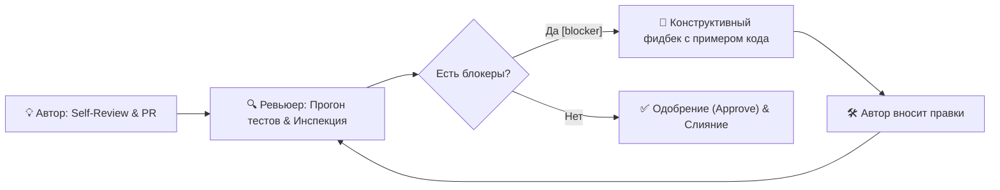
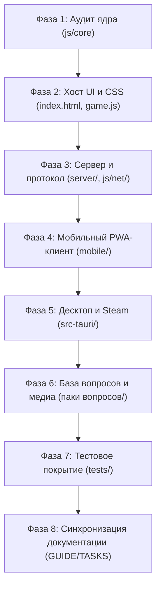

# 🧐 Руководство по конструктивному код-ревью и план ревью проекта (REVIEW_GUIDE)

> **Назначение документа:** Официальный регламент проведения конструктивного код-ревью в проекте Quiz U («Город Ю»), культура и этика взаимодействия разработчиков, классификация замечаний, инженерные чек-листы по компонентам системы и пошаговый план комплексного ревью всего проекта.
>
> 🔗 **Связанные документы:**
> * [DEV_GUIDE.md](file:///C:/Users/user/IdeaProjects/quiz_u/DEV_GUIDE.md) — инженерные правила для разработчиков, архитектурные инварианты и Git Workflow.
> * [PLAN.md](file:///C:/Users/user/IdeaProjects/quiz_u/PLAN.md) — общая архитектура, стек и концепция Jackbox-мультиплеера.
> * [ROADMAP.md](file:///C:/Users/user/IdeaProjects/quiz_u/ROADMAP.md) — глобальные релизные этапы и трекер прогресса.
> * [TASKS.md](file:///C:/Users/user/IdeaProjects/quiz_u/TASKS.md) — оперативный трекер задач, фичей и багов.
> * [DESIGN_GUIDE.md](file:///C:/Users/user/IdeaProjects/quiz_u/DESIGN_GUIDE.md) — дизайн, маркетинг и подготовка ассетов для Steam Direct.
> * [.aiassistant/rules/code style rules.md](file:///C:/Users/user/IdeaProjects/quiz_u/.aiassistant/rules/code%20style%20rules.md) — стандарты кода и правила кодовой базы.

---

## 1. Культура и философия конструктивного ревью

Код-ревью в проекте Quiz U — это не поиск виновных и не барьер перед мержем, а **инструмент совместного улучшения качества продукта**, взаимного обучения и поддержания архитектурной чистоты.

### 1.1. Базовые принципы
1. **Разделяйте код и личность автора:** Критикуйте архитектурные и программные решения, а не навыки или компетенции человека.
   - *Неконструктивно:* «Ты опять забыл обработать null, сколько можно».
   - *Конструктивно:* «Элемент `#online-buzzer-banner` может отсутствовать в DOM в оффлайн-режиме, что приведёт к `TypeError`. Рекомендую добавить защитную проверку `if (banner) { ... }`.»
2. **Презумпция добрых намерений:** Исходите из того, что автор стремился решить задачу наилучшим известным ему способом в рамках контекста задачи.
3. **Объясняйте контекст и риски («Почему?»):** Каждое замечание должно объяснять причину, стоящую за ним (безопасность, производительность, регрессия оффлайна, поломка тем).
4. **Предлагайте конкретное решение с примером кода:** Не ограничивайтесь констатацией дефекта — покажите, как именно его устранить.
5. **Хвалите за хорошие решения (`[praise]`):** Конструктивное ревью обязательно отмечает чистые абстракции, эффективные алгоритмы, продуманные тесты и красивый UI.

---

## 2. Стандарт префиксов комментариев (Conventional Comments)

Каждый комментарий в рамках ревью должен начинаться с одного из стандартизированных префиксов:

| Префикс | Значение | Блокирует мерж? | Пример использования |
| :--- | :--- | :---: | :--- |
| `[blocker]` | Критический дефект, нарушение инвариантов, падение тестов, уязвимость | **Да** | `[blocker]: Ответ на вопрос передаётся в открытом виде клиентам игроков, что нарушает античит-модель проекта.` |
| `[should]` | Важное функциональное или архитектурное упущение, неучтённый edge-case | **Да** | `[should]: При размонтировании модального окна не очищается интервал анимации таймера, возможна утечка памяти.` |
| `[suggestion]` | Предложение по оптимизации или улучшению читаемости | Нет | `[suggestion]: Эту фильтрацию по категориям можно вынести в хелпер js/core/PackParser.js для переиспользования.` |
| `[nit]` | Мелкая придирка, опечатка в документации, форматирование | Нет | `[nit]: Опечатка в подписи кнопки: «Октрыть» -> «Открыть».` |
| `[question]` | Уточняющий вопрос по логике для понимания контекста | Нет | `[question]: Почему здесь выбран фиксированный таймаут 5с вместо использования значения из options.answerTime?` |
| `[praise]` | Признание отличного инженерного или дизайнерского решения | Нет | `[praise]: Отличная идея с SVG progress-ring для таймера, анимация плавная и не триггерит reflow!` |

---

## 3. Архитектурные инварианты Quiz U (Quality Gates)

Любой Pull Request или коммит проходит проверку на строгое соблюдение фундаментальных правил проекта:

### 3.1. Zero-Build & Vanilla Stack для Web-части
- Клиентский код (`index.html`, `js/`, `css/`, `mobile/`) написан на **чистом ES6+, HTML5 и CSS3**.
- **Категорически запрещены** Webpack, Vite, Rollup, Babel, TypeScript и тяжёлые фреймворки (React, Vue, Angular, jQuery, Lodash).
- Любая библиотека в веб-части должна быть автономным zero-dependency файлом (как `qrcode.min.js`).

### 3.2. Поддержка двух тем (Dark / Light Theme)
- Каждая новая экранная форма, кнопка, модальное окно или бейдж обязаны корректно отображаться в:
  1. Тёмной теме (`body` по умолчанию);
  2. Светлой теме (`body.light-theme`).
- Запрещено хардкодить статические цвета текста и фона без учёта CSS-переменных (`var(--bg-...)`, `var(--text-...)`).
- Контрастность текста по стандарту WCAG AA обязательна в обоих режимах.

### 3.3. Сохранение классической оффлайн-игры («Двойной режим»)
- Никакие изменения сетевого мультиплеера не должны нарушать работу классической локальной викторины за одним экраном.
- В главном меню сохраняется чёткое разделение: «Локальная игра» и «Сетевая комната».
- При отсутствии сети оффлайн-игра должна работать автономно при открытии `index.html`.

### 3.4. Авторитарный сервер и античит
- Сервер — единственный источник истины для состояний, таймингов и очереди ответов.
- **Поле правильного ответа (`question.a`, `question.a_img`) никогда не отправляется на мобильные устройства игроков** до завершения раунда ответа.

### 3.5. Защитное программирование (Defensive DOM & Error Handling)
- Любое обращение к DOM должно проверять существование узла (`if (element) { ... }`).
- Чтение и запись в `localStorage`, `JSON.parse`, вызовы Web Audio API оборачиваются в `try/catch`.
- Все таймеры и интервалы сбрасываются при смене экранов и перезапуске раундов.

### 3.6. Портативность и относительные пути
- Пути к ресурсам — только относительные, со слэшем `/` (например, `assets/music/track.mp3`).
- Запрещены абсолютные пути операционной системы (`C:\...`, `/Users/...`).

### 3.7. Модель ветвления Git
- Ветки `main` и `dev` **заморожены** для сетевого кода.
- Базовая ветка для всей сетевой разработки — **`feature/online-multiplayer`**.
- Слияние сетевых веток разрешено только обратно в `feature/online-multiplayer` с флагом `--no-ff`.

### 3.8. 100% зелёные автотесты
- Клиентские тесты в корне: `npm test` (128+ тестов).
- Серверные тесты: `cd server && npm test` (18+ тестов).
- Падение хотя бы одного теста является безусловным блокером мержа.

---

## 4. Процесс ревью и роли участников

### 4.1. Роль автора (Author)
1. **Self-Review (Самопроверка):**
   - До запроса ревью автор выполняет `git diff` и лично просматривает каждую изменённую строку.
   - Запускает оба набора тестов (`npm test` в корне и `cd server && npm test`).
2. **Оформление описания (Pre-Push Summary):**
   - Подготавливает сводку согласно разделу 1.2 [DEV_GUIDE.md](file:///C:/Users/user/IdeaProjects/quiz_u/DEV_GUIDE.md): список фичей, затронутые файлы, статус тестов, обновление трекеров.
3. **Обновление проектных трекеров:**
   - Переводит статусы задач в [TASKS.md](file:///C:/Users/user/IdeaProjects/quiz_u/TASKS.md) и [ROADMAP.md](file:///C:/Users/user/IdeaProjects/quiz_u/ROADMAP.md).
4. **Конструктивное реагирование:**
   - Отвечает на комментарии ревьюера, благодарит за найденные дефекты, при несогласии приводит аргументы на основе архитектурных требований.

### 4.2. Роль ревьюера (Reviewer)
1. **Погружение в задачу:**
   - Изучает связанную задачу в [TASKS.md](file:///C:/Users/user/IdeaProjects/quiz_u/TASKS.md) или [ROADMAP.md](file:///C:/Users/user/IdeaProjects/quiz_u/ROADMAP.md).
2. **Локальная верификация:**
   - При необходимости выкачивает ветку и запускает тесты локально.
3. **Инспекция по слоям:**
   - Проверяет код с использованием покомпонентных чек-листов (раздел 5).
4. **Формулирование фидбека:**
   - Использует стандарт Conventional Comments (`[blocker]`, `[should]`, `[suggestion]`, `[praise]`).
   - Даёт конкретные примеры исправлений.
5. **SLA ревью:**
   - Первичный ответ на PR предоставляется в течение 24 часов в рабочие дни.

---

## 5. Инженерные чек-листы по компонентам системы

### 5.1. Чек-лист: Ядро и бизнес-логика (`js/core/`)
- [ ] Модули чистые, изолированы от DOM и глобального объекта `window` (поддержка изоморфного запуска в Node.js / UMD).
- [ ] Переходы состояний в `GameStateMachine.js` детерминированы, недопустимые переходы возвращают ошибку или `false`.
- [ ] Начисление очков в `ScoreManager.js` корректно обрабатывает ставки аукциона и отрицательный счёт.
- [ ] `PackParser.js` валидирует структуру раундов, тем и вопросов без генерации исключений.
- [ ] Написаны модульные тесты в [tests/](file:///C:/Users/user/IdeaProjects/quiz_u/tests/) на каждую новую ветку бизнес-логики.

### 5.2. Чек-лист: Интерфейс хоста и стили (`index.html`, `js/game.js`, `css/`)
- [ ] Новая разметка и компоненты корректно выглядят в Dark и Light темах.
- [ ] Стили адаптивны (поддерживают desktop от 1024px, tablet 768–1023px, mobile до 767px и экран Steam Deck 1280x800).
- [ ] Использованы свойства `transform` и `opacity` для анимаций (аппаратное ускорение).
- [ ] Все кнопки и интерактивные зоны имеют `cursor: pointer`, hover/active состояния и поддержку фокуса.
- [ ] Оффлайн-режим работает без ошибок при старте без поднятого WebSocket-сервера.

### 5.3. Чек-лист: Мобильный клиент (`mobile/`)
- [ ] Viewport заблокирован от случайного двойного тапа и масштабирования пальцами (`user-scalable=no`).
- [ ] Кнопка Buzzer большая, удобна для нажатия большим пальцем любой руки.
- [ ] Реализован тактильный виброотклик (`navigator.vibrate`) с безопасной проверкой наличия API.
- [ ] Реконнект по `sessionToken` из `localStorage` восстанавливает состояние без потери никнейма и очков.
- [ ] Поддерживаются экраны для роли «Игрок» и роли «Ведущий» (Host Remote Controls).

### 5.4. Чек-лист: Авторитарный сервер (`server/`)
- [ ] Сервер валидирует все входные JSON-сообщения на наличие обязательных полей.
- [ ] Поле ответа `question.a` фильтруется античитом и не рассылается игрокам.
- [ ] Арбитраж баззера защищён от race conditions (побеждает ровно один игрок, повторные нажатия отклоняются).
- [ ] HTTP-сервер защищён от Path Traversal атак (`cleanPath.includes('..')` блокируется с кодом 403).
- [ ] Корректно поддерживаются Cyrillic URL-encoded пути к пакетам вопросов.
- [ ] Таймеры неактивных комнат очищаются через `.unref()`, отсутствуют утечки соединений.

### 5.5. Чек-лист: Десктоп-сборка и Gamepad (`src-tauri/`, `SteamIntegration.js`)
- [ ] Приложение запускается автономно без падений в окружениях без установленного клиента Steam.
- [ ] Gamepad API корректно обрабатывает подключение и отключение контроллеров на лету.
- [ ] Кнопка паузы и навигация по сетке таблицы вопросов работают с геймпада.
- [ ] Реализован безопасный graceful fallback для Steamworks SDK.

---

## 6. План комплексного ревью всего проекта (Comprehensive Project Review Plan)

Ниже представлен пошаговый стратегический план аудита всей кодовой базы Quiz U, охватывающий все архитектурные уровни:

### Фаза 1: Аудит ядра и бизнес-логики (`js/core/`)
* **Цель:** Обеспечить 100% изоляцию чистой логики от UI и браузерного окружения.
* **Объекты проверки:**
  - [js/core/GameStateMachine.js](file:///C:/Users/user/IdeaProjects/quiz_u/js/core/GameStateMachine.js)
  - [js/core/ScoreManager.js](file:///C:/Users/user/IdeaProjects/quiz_u/js/core/ScoreManager.js)
  - [js/core/PackParser.js](file:///C:/Users/user/IdeaProjects/quiz_u/js/core/PackParser.js)
  - [js/core/CdnManager.js](file:///C:/Users/user/IdeaProjects/quiz_u/js/core/CdnManager.js)
* **Контрольные точки аудита:**
  1. Отсутствие прямых вызовов `document`, `window`, `localStorage` внутри модулей ядра.
  2. Детерминированность переходов FSM (LOBBY -> BOARD -> QUESTION -> BUZZ -> ANSWER -> ROUND_END).
  3. Корректность нормализации структуры пакетов в `PackParser.normalizeGameData()`.
  4. Механизм прозрачного отката на локальные ассеты при недоступности CDN в `CdnManager`.

### Фаза 2: Хост-приложение и визуальный слой (`index.html`, `js/game.js`, `css/`)
* **Цель:** Проверить стабильность интерфейса хоста, плавность анимаций и безупречность стилей.
* **Объекты проверки:**
  - [index.html](file:///C:/Users/user/IdeaProjects/quiz_u/index.html)
  - [js/game.js](file:///C:/Users/user/IdeaProjects/quiz_u/js/game.js)
  - [js/catalog.js](file:///C:/Users/user/IdeaProjects/quiz_u/js/catalog.js)
  - [css/style.css](file:///C:/Users/user/IdeaProjects/quiz_u/css/style.css)
  - [css/catalog.css](file:///C:/Users/user/IdeaProjects/quiz_u/css/catalog.css)
* **Контрольные точки аудита:**
  1. Отсутствие битых символов кодировки `\uFFFD` в HTML и CSS файлах.
  2. Корректность работы стартового выбора режима («Локальная игра» / «Сетевая комната»).
  3. Полнота стилей для тёмной и светлой тем (`.light-theme`).
  4. Центрирование и гармоничность кнопок модальных окон (`.modal-controls`, `.modal-actions`).
  5. Безопасность Web Audio API: lazy-init AudioContext, проверка `state === 'suspended'`.

### Фаза 3: Авторитарный сервер и сетевой транспорт (`server/`, `js/net/`)
* **Цель:** Проверить надёжность WebSocket-соединений, арбитраж баззера и безопасность.
* **Объекты проверки:**
  - [server/src/server.js](file:///C:/Users/user/IdeaProjects/quiz_u/server/src/server.js)
  - [server/src/Room.js](file:///C:/Users/user/IdeaProjects/quiz_u/server/src/Room.js)
  - [server/src/RoomManager.js](file:///C:/Users/user/IdeaProjects/quiz_u/server/src/RoomManager.js)
  - [server/src/protocol.js](file:///C:/Users/user/IdeaProjects/quiz_u/server/src/protocol.js)
  - [js/net/NetworkClient.js](file:///C:/Users/user/IdeaProjects/quiz_u/js/net/NetworkClient.js)
  - [js/net/Protocol.js](file:///C:/Users/user/IdeaProjects/quiz_u/js/net/Protocol.js)
* **Контрольные точки аудита:**
  1. Синхронность констант между `server/src/protocol.js` и `js/net/Protocol.js`.
  2. Защита от утечки ответов: игрокам не уходят поля `question.a` и `question.a_img`.
  3. Корректность раздачи статических файлов для хоста (`/`, `/css/`, `/js/`, `/assets/`).
  4. Защита от Path Traversal при отдаче файлов и пакетов вопросов.
  5. Корректность автоочистки комнат по тайм-ауту 15 минут.

### Фаза 4: Мобильный PWA-клиент игрока и ведущего (`mobile/`)
* **Цель:** Валидация удобства управления со смартфона, скорости отклика и стабильности.
* **Объекты проверки:**
  - [mobile/index.html](file:///C:/Users/user/IdeaProjects/quiz_u/mobile/index.html)
  - [mobile/mobile.css](file:///C:/Users/user/IdeaProjects/quiz_u/mobile/mobile.css)
  - [mobile/mobile.js](file:///C:/Users/user/IdeaProjects/quiz_u/mobile/mobile.js)
  - [mobile/manifest.json](file:///C:/Users/user/IdeaProjects/quiz_u/mobile/manifest.json)
* **Контрольные точки аудита:**
  1. Наличие и работоспособность всех 6 экранов игрока + экрана пульта ведущего (`#screen-host`).
  2. Мгновенная отправка сигнала баззера при таче без задержки 300мс.
  3. Полнота пульта ведущего: зачёт/отклонение ответа, показ ответа на ТВ, пауза, ручная корректировка счёта.
  4. Восстановление роли и сессии при обрыве соединения и реконнекте.

### Фаза 5: Десктоп-сборка и платформа Steam (`src-tauri/`)
* **Цель:** Проверить работоспособность нативного бинарника для ПК и Steam Deck.
* **Объекты проверки:**
  - [src-tauri/tauri.conf.json](file:///C:/Users/user/IdeaProjects/quiz_u/src-tauri/tauri.conf.json)
  - [src-tauri/Cargo.toml](file:///C:/Users/user/IdeaProjects/quiz_u/src-tauri/Cargo.toml)
  - [src-tauri/src/main.rs](file:///C:/Users/user/IdeaProjects/quiz_u/src-tauri/src/main.rs)
  - [js/desktop/SteamIntegration.js](file:///C:/Users/user/IdeaProjects/quiz_u/js/desktop/SteamIntegration.js)
  - [js/desktop/GamepadManager.js](file:///C:/Users/user/IdeaProjects/quiz_u/js/desktop/GamepadManager.js)
* **Контрольные точки аудита:**
  1. Разрешение 1280x800 по умолчанию в конфиге Tauri для идеальной посадки на Steam Deck.
  2. Переключение в полноэкранный режим по `F11`.
  3. Навигация по игровому табло с D-Pad и аналоговых стиков.
  4. Безопасный fallback при запуске вне среды Steam.

### Фаза 6: База вопросов и медиа-ресурсы
* **Цель:** Проверить целостность и валидность базы вопросов (400+ паков).
* **Объекты проверки:**
  - Каталог `паки вопросов/`
  - [js/packs_data.js](file:///C:/Users/user/IdeaProjects/quiz_u/js/packs_data.js)
  - [js/packs_catalog.json](file:///C:/Users/user/IdeaProjects/quiz_u/js/packs_catalog.json)
  - [scripts/optimize_media.js](file:///C:/Users/user/IdeaProjects/quiz_u/scripts/optimize_media.js)
* **Контрольные точки аудита:**
  1. Все JSON-файлы пакетов синтаксически валидны и сохранены в кодировке UTF-8.
  2. В паках отсутствуют захардкоженные `type` (динамическое назначение в раундах).
  3. Относительные пути к медиафайлам (`assets/music/`, `assets/video/`, `assets/q_img/`).
  4. Отсутствие избыточно тяжёлых неоптимизированных медиафайлов.

### Фаза 7: Автоматизированное тестирование и стресс-тесты
* **Цель:** Обеспечить воспроизводимость и надёжность всех проверок.
* **Объекты проверки:**
  - [tests/](file:///C:/Users/user/IdeaProjects/quiz_u/tests/) (клиентские тесты)
  - [server/tests/](file:///C:/Users/user/IdeaProjects/quiz_u/server/tests/) (серверные тесты)
  - [server/load_test/simulate_load.js](file:///C:/Users/user/IdeaProjects/quiz_u/server/load_test/simulate_load.js)
* **Контрольные точки аудита:**
  1. 100% успешное прохождение всех клиентских тестов (`npm test`).
  2. 100% успешное прохождение серверных тестов (`cd server && npm test`).
  3. Прохождение стресс-теста (50 комнат, 200 игроков, 0 потерянных пакетов).

### Фаза 8: Документация и синхронизация регламентов
* **Цель:** Поддерживать документацию в актуальном и непротиворечивом состоянии.
* **Объекты проверки:**
  - [README.md](file:///C:/Users/user/IdeaProjects/quiz_u/README.md)
  - [DEV_GUIDE.md](file:///C:/Users/user/IdeaProjects/quiz_u/DEV_GUIDE.md)
  - [ROADMAP.md](file:///C:/Users/user/IdeaProjects/quiz_u/ROADMAP.md)
  - [TASKS.md](file:///C:/Users/user/IdeaProjects/quiz_u/TASKS.md)
  - [PLAN.md](file:///C:/Users/user/IdeaProjects/quiz_u/PLAN.md)
  - [DESIGN_GUIDE.md](file:///C:/Users/user/IdeaProjects/quiz_u/DESIGN_GUIDE.md)
  - [REVIEW_GUIDE.md](file:///C:/Users/user/IdeaProjects/quiz_u/REVIEW_GUIDE.md)
* **Контрольные точки аудита:**
  1. Все внутренние ссылки оформлены кликабельными ссылками со схемой `file:///` и прямыми слэшами.
  2. Счётчики тестов и статусы этапов в `ROADMAP.md` и `TASKS.md` согласованы с реальностью.
  3. Инструкции по запуску в `README.md` проверены на актуальность.

---

## 7. Журнал результатов аудита проекта (Audit Findings Log)

При проведении полного ревью проекта результаты фиксируются в следующей таблице:

| Дата аудита | Компонент / Модуль | Выявленные замечания | Классификация | Статус устранения |
| :---: | :--- | :--- | :---: | :---: |
| 2026-10-03 | Регламент ревью | Отсутствие стандартизированных инструкций и плана ревью | `[blocker]` | ✅ Устранено (создан `REVIEW_GUIDE.md`) |
| 2026-10-03 | Git Templates | Отсутствие шаблона Pull Request для GitHub | `[should]` | ✅ Устранено (создан `.github/pull_request_template.md`) |
| 2026-10-03 | Документация | Синхронизация ссылок на гайд по ревью в `DEV_GUIDE`, `README` и `TASKS` | `[should]` | ✅ Устранено |
