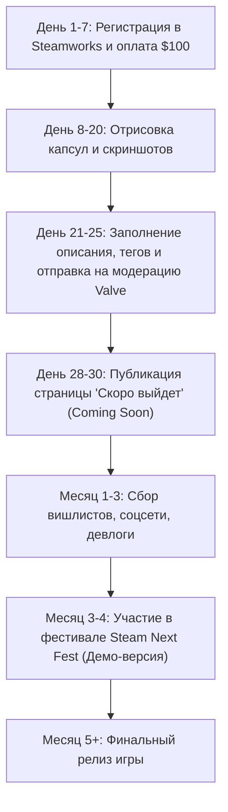

# 🎨 Организационный план: Steam Direct, визуальное оформление и SMM-маркетинг (DESIGN_GUIDE)

> **Назначение документа:** Комплексный организационный и визуально-маркетинговый план для онлайн-викторины **Quiz U**.  
> Содержит регламент открытия и оформления страницы в **Steam**, технические требования ко всем графическим ассетам, стратегию сбора вишлистов (Wishlists) и пошаговый контент-план продвижения в социальных сетях.
>
> 📁 **Связанные документы:**
> * [DEV_GUIDE.md](DEV_GUIDE.md) — правила разработки и саммари.
> * [ROADMAP.md](ROADMAP.md) — трекер этапов разработки.

---

## ЧАСТЬ 1. Запуск и оформление страницы в Steam (Steam Direct)

### 1. Юридическая и финансовая регистрация в Steamworks
1. **Создание партнерского аккаунта:**
   * Регистрация на портале [partner.steamgames.com](https://partner.steamgames.com).
   * Заполнение профиля разработчика (физлицо, самозанятый или юрлицо).
   * Прохождение налогового интервью (W-8BEN для избежания двойного налогообложения).
   * Привязка банковских реквизитов для выплат роялти.
2. **Оплата слота Steam Direct Fee:**
   * Взнос $100 за слот игры (возвращается Valve после достижения выручки в $1,000).
   * Ожидание верификации данных от Valve (обычно от 3 до 7 рабочих дней).

---

### 2. Спецификация графических ассетов Steam (Размеры и требования)

Все изображения должны быть сохранены в форматах **PNG** (без альфа-канала, если не указано иное) или **JPG** высокого качества.

| Тип ассета | Точные размеры (px) | Назначение и где отображается | Требования к контенту |
| :--- | :---: | :--- | :--- |
| **Header Capsule** *(Главная)* | `460 x 215` | Страница магазина, списки поиска, вишлисты | Логотип игры + сочный ключевой арт. Текст только название игры. |
| **Small Capsule** | `231 x 87` | Боковые списки рекомендаций, спецпредложения | Максимально читаемое лого игры на контрастном фоне. |
| **Main Capsule** | `616 x 353` | Главная страница Steam, баннеры витрины | Высокая детализация, персонажи/анимация (кот, аукцион), лого. |
| **Vertical Capsule** *(Библиотека)* | `374 x 448` (или `600 x 900`) | Сетка Библиотеки Steam нового интерфейса | Вертикальный постер, акцент на атмосферу вечеринки и викторины. |
| **Page Background** | `1438 x 810` | Фон страницы игры в магазине (затемненный) | Без логотипа, градиент в темный цвет к краям, не отвлекает от текста. |
| **Hero Graphic** (Библиотека) | `1920 x 620` | Шапка игры в библиотеке пользователя | Широкий баннер без логотипа (логотип накладывается отдельно). |
| **Logo** (Библиотека) | `1280 x 720` (PNG с прозрачностью) | Логотип поверх Hero Graphic в библиотеке | Чистый прозрачный логотип Quiz U. |
| **Community Icon** | `184 x 184` | Иконка сообщества, списки друзей, чат | Квадратная узнаваемая иконка (буква «U» / силуэт кота). |
| **Client Icon** | `32 x 32` (.ico) | Иконка приложения на рабочем столе и панели задач | Высококонтрастная иконка для Windows. |

---

### 3. Текстовое позиционирование страницы (Copywriting)

#### 3.1. Краткое описание (Short Description, до 300 символов)
> *«Веселая командная онлайн-викторина для друзей, стримов и вечеринок! Запускайте игру на ПК или ТВ, подключайтесь со смартфонов за 5 секунд по QR-коду без установки приложений. Сотни тем, музыкальные раунды, видеовопросы, торги в Аукционе и коварный Кот в мешке!»*

#### 3.2. Основное описание (About This Game)
Структура с GIF-анимациями (размер гифок до 3 МБ):
1. **Крючок (Хук):** Краткий лозунг — *«Ваш смартфон — ваш пульт!»*.
2. **Как играть (Гифка с QR-кодом):**
   * Ведущий запускает игру на ПК, ноутбуке или Steam Deck.
   * Игроки сканируют QR-код камерой телефона и попадают в комнату.
3. **Ключевые игровые механики (Гифки):**
   * ⚡ **Борьба за кнопку (Buzzer):** кто первый нажал на телефоне — тот и отвечает!
   * 🐱 **Кот в мешке:** неожиданные вопросы с передачей хода сопернику.
   * 🔨 **Аукцион со ставками:** идите ва-банк или блефуйте.
   * 🎵 **Медиараунды:** отгадывайте саундтреки, клипы и мемы.
4. **Мастерская Steam (Workshop):** создавайте свои паки вопросов и делитесь ими с комьюнити.
5. **Системные требования:** минимальные (запустится даже на слабых ноутбуках и Steam Deck).

#### 3.3. Теги и категории Steam
* **Категории:** Для одного игрока (хост), Локальный мультиплеер, Совместная игра по сети, Кроссплатформенный мультиплеер, Поддержка геймпадов, Steam Cloud.
* **Теги (в порядке убывания приоритета):** `Викторина (Trivia)`, `Для вечеринок (Party Game)`, `Казуальная игра`, `Мультиплеер`, `Для нескольких игроков`, `Смешная`, `Совместная локальная`, `2D`.

---

### 4. Скриншоты и видео-трейлер

1. **Правила для скриншотов (Минимум 5–8 штук, разрешение 1920x1080):**
   * Скриншот 1: Общее табло вопросов со стильной темой и категориями.
   * Скриншот 2: Процесс ответа на вопрос с таймером и кнопкой ответа.
   * Скриншот 3: Анимация «Кота в мешке» с вылезающим котом.
   * Скриншот 4: Аукцион с молотком и ставками команд.
   * Скриншот 5: Коллаж: экран хоста на ТВ + смартфоны игроков в руках.
   * Скриншот 6: Каталог сотен готовых паков и фильтры.
2. **Геймплейный трейлер (длительность 45–60 секунд):**
   * **0:00–0:05 (Хук):** Ведущий жмет «Создать комнату», появляется QR-код. Игроки сканируют телефоном — подключились!
   * **0:05–0:25:** Динамичная нарезка игры: вспышка кнопки ответа, радость от правильного ответа, штраф за ошибку.
   * **0:25–0:40:** Демонстрация спец-вопросов: кот в мешке, молоток аукциона, видео-вопрос.
   * **0:40–0:50:** Поддержка Steam Deck и кросс-плей со всеми смартфонами.
   * **0:50–0:60:** Призыв: *«Добавьте в список желаемого (Wishlist)!»*.

---

## ЧАСТЬ 2. План запуска страницы «Coming Soon» и сбор вишлистов

> ⚠️ **Главное правило Steam-маркетинга:** Страница игры должна быть опубликована в статусе **«Скоро выйдет» (Coming Soon) минимум за 3–6 месяцев до релиза**, чтобы набрать критическую массу вишлистов (цель: 3,000–7,000+ вишлистов к релизу для попадания в раздел «Популярные новинки»).

### Календарный план подготовки страницы Steam


---

## ЧАСТЬ 3. Стратегия ведения социальных сетей и продвижения

### 1. Целевая аудитория (ЦА)
1. **Компании друзей и семьи (20–40 лет):** игра на праздниках, пятничных посиделках, настольных вечерах.
2. **Стримеры (Twitch / YouTube / VK Play):** интерактив со зрителями (зрители со смартфонов заходят в лобби стримера).
3. **Корпоративный сегмент и образовательные учреждения:** квизы для тимбилдингов, квизы для уроков и лекций.

---

### 2. Каналы коммуникации и форматы контента

#### А. Telegram-канал & VK-сообщество (Русскоязычное ядро)
* **Цель:** Прямое общение с игроками, сбор фидбека, анонсы турниров.
* **Рубрики:**
  * 📦 *«Пак недели»* — анонс новой подборки вопросов (кино 2000-х, мемы, IT-викторина).
  * 🛠️ *«Девлог / За кулисами»* — как игра упаковывается под Steam Deck, как работает синхронизация телефонов.
  * 💡 *«Вопрос дня»* — интерактивный опросник для проверки эрудиции подписчиков.
  * 🏆 *«Стрим-квиз»* — анонсы совместных игр с известными стримерами.

#### Б. Короткие вертикальные видео (TikTok, YouTube Shorts, Reels, VK Клипы)
* **Цель:** Вирусный бесплатный органический трафик на вишлисты Steam.
* **Идеи роликов:**
  1. *«Как мы заменили Jackbox своей бесплатной игрой для вечеринок»* (демонстрация подключения с телефона).
  2. Реакция на коварного «Кота в мешке», когда игрок подставил друга.
  3. Нелепые и смешные ответы игроков в стрессовой ситуации за 5 секунд таймера.
  4. Сравнение игры на ТВ через Steam Deck и на обычных телефонах.

#### В. Discord-сервер (Комьюнити и Playtest)
* Каналы: `#announcements`, `#feedback`, `#custom-packs` (обмен вопросами), `#looking-for-game` (поиск компании для игры в онлайне).
* Закрытые бета-тесты для самых активных участников с выдачей роли `Beta Tester` и ключей к игре.

---

### 3. Пошаговый контент-план по фазам кампании

```text
┌────────────────────────────────────────────────────────────────────────┐
│                        ФАЗЫ МАРКЕТИНГОВОЙ КАМПАНИИ                     │
├───────────────────┬───────────────────┬────────────────────────────────┤
│  ФАЗА 1: ТИЗЕРЫ   │  ФАЗА 2: NEXT FEST│      ФАЗА 3: РЕЛИЗ             │
│  (За 3-4 мес.)    │  (За 1-2 мес.)    │      (Неделя релиза + пост)    │
├───────────────────┼───────────────────┼────────────────────────────────┤
│ • Открытие Steam  │ • Выпуск Демо     │ • Релизный трейлер             │
│ • Запуск Shorts/VK│ • Стримы разработ.│ • Рассылка ключей стримерам    │
│ • Сбор базы паков │ • Пик вишлистов   │ • Скидка 10% на старте         │
│ • Тесты с друзьями│ • Сбор фидбека    │ • Первый турнир комьюнити      │
└───────────────────┴───────────────────┴────────────────────────────────┘
```

#### Фаза 1: Дорелизный прогрев (Pre-Launch & Wishlist Engine)
- [ ] Запуск страницы Steam («Скоро выйдет»). Ссылка на страницу во всех шапках профилей.
- [ ] Публикация 2–3 коротких клипов в неделю (Shorts/TikTok/Reels).
- [ ] Статьи на DTF, Хабр и Pikabu: *«Как мы создали кроссплатформенный аналог Своей Игры для Steam и смартфонов»*.

#### Фаза 2: Фестиваль «Играм быть» (Steam Next Fest)
- [ ] Подготовка публичной демо-версии (3 готовых раунда, поддержка до 6 игроков со смартфонов).
- [ ] Проведение 2 официальных прямых трансляций разработчика на странице игры в Steam.
- [ ] Сбор обратной связи по удобству мобильного пульта и стабильности сокетов.

#### Фаза 3: Неделя релиза (Launch Week)
- [ ] Рассылка ключей микростримерам (50–500 зрителей) с предложением сыграть со своей аудиторией.
- [ ] Стартовая скидка 10–15% на первую неделю.
- [ ] Публикация первого патча первого дня с благодарностью комьюнити.

---

## ЧАСТЬ 4. Чек-лист готовности к подаче в Steamworks

- [ ] Все капсулы (`460x215`, `231x87`, `616x353`, `374x448`) отрисованы и читаются в мелком масштабе.
- [ ] Скриншоты показывают реальный игровой процесс без замыливания.
- [ ] Описание переведено на 2 языка: русский и английский.
- [ ] В описании четко указано требование: *«Для игры со смартфонов требуется подключение к интернету / локальной сети»*.
- [ ] Подготовлены ссылки на сообщества (Discord, Telegram, VK).
- [ ] Пройдена проверка чек-листа Steam перед публикацией Coming Soon.
